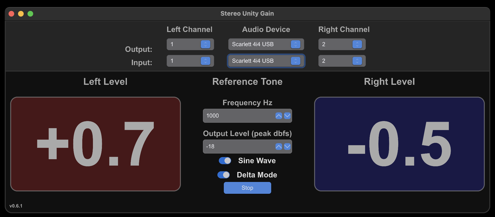

# Stereo Unity Gain (SUG)

A simple app with big easy to see from across room level meters to help you set your audio interfaces input gain to unity and balance stereo pairs. Or what ever else you want to do with it. Use your imagination.  If you come up with a novel use case please let me know.

## Screen Shot

(Default settings)

## Description

There are 2 stages to the application:

#### Input Stage:

An adjustable sine wave generator that lets you choose an output device and pair of ports to use to send the tone too. You can adjust the 
frequency and outout level (in dbfs). The output level is calibrated to show the same output level as your DAW or other audio apps (or at least mine anyway: Ableton, Reaper, Audacity) would at the specified output level. 

#### Output Stage:

A peak level meter. Level is calculated, like the output stage, based on what your DAW should see as peak dbfs from the inputs. It is NOT calculating intersample peaks and it does not do peak hold.

Peak in this case is a rolling max value, positive or negative, of the samples in 20 consecutive sample buffers. Buffer size is the default size provided by your interface. Mibe gives 512 samples generally as an example. Left and right channels are calculated independently.

### Display Modes

Both use the same peak calculation but show the level differently.

##### Delta Mode:

This is the default mode

The level meter will show the differnece between the input level it reads and the reference output level.

- ie. If the output is -12 dbfs and it reads -10 dbfs from the input it will show +2.0 indicating that your input is 2 dbfs louder than the output reference tone and you should decrease the input gain to get to unity.
- It will also colour code the level display:
  - **Red** indicates "Hot" input levels that are above above the reference level. It will also show a + in front of the value
  - **Blue** indicates "Cold" input levels that are below the reference level. It will also show a - in front of the value
  - **Green** indicates unity gain has been reached within +/- 0.1 dbfs.  While you can keep tweaking the input level to get to 0.0, things are only so accurate and it is probably not going to stay there anyway given time and temperature fluctuations etc. So -0.1 to 0.1 is generally close enough. But do what makes you happy.

##### Peak Mode:

When Delta mode is disabed

This mode shows the rolling peak level of your input signal. 

You can use it to set levels above and below unity, you can use it to off set a stereo pair of channels by a given amount to "pan" the stereo signal or use it with signals not generated by this app. 

## Build Steps:

These are really just the high level steps. Hopefully you already have at least basic familiarity with building projects from git.

- You will need a Rust language tool chain setup. You can get it here:
  - https://rustup.rs/
- Then grab this code base from gitlab:
  - https://gitlab.com/joltedbot-public/stereo-unity-gain
- In the root of the git repository you downloaded run `cargo build -r` this will generate a release binary
- The binary will be in the `target/release` folder and named `stereo-unity-gain`. Grab that in put it somewhere you can run it.
- Then just execute that binary to start the app

## Usage Steps

- Connect the audio device/devices to your computer and make sure your OS recognizes them. 
- The app does not currently check again for devices so if you need to rescan you need to restart the app. This is on my todo list.
- Physically connect a pair of audio outputs to inputs
  - I just use a pair of balanced patch cables and plug the outputs to the inputs on my patch bay or right on the ports on the audio interface
- Start Stereo Unity Gain
- Select the input and output devices in the center drop down menus
- Select the left and right input and output channels from the drop downs to either side of the device dropdowns
- Hit the start button
- Dial in the input gain on your audio device until the level meters show 0.0 or what ever value you want to target
